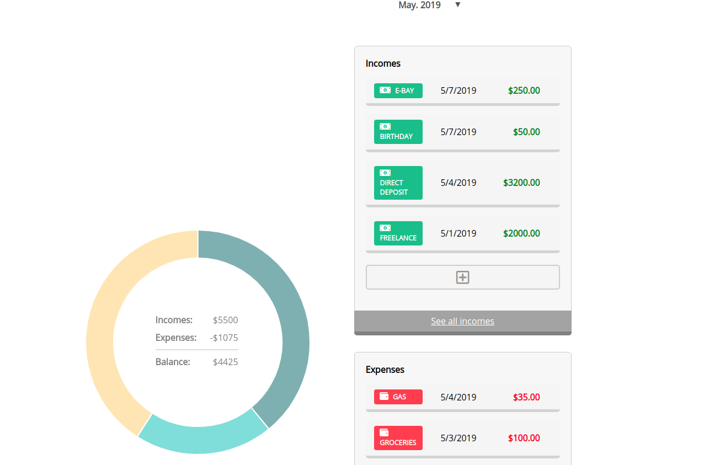
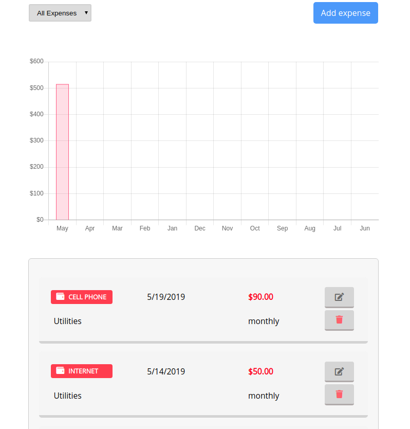

# Spendful

Michael Bonner, Ethan Zimmerman, Andre Willie, Zoljargal Fallows, and Chris Carnivale

[LiveApp](http://spendful.now.sh)
[Server Repo](https://github.com/thinkful-ei-armadillo/spendful-server)

## Summary

Reach your financial goals by tracking every dollar you spend and earn.  This app allows you to 
add all of your incomes and expenses and visualize them through convenient charts and graphs.  The
front-end utilizes React to create a responsive design.  The back-end leverages the RRule library to allow
for recurring expenses.

## Pages

#### Dashboard Page

As a logged in user, communicates with `get api/categories` to retrieve all categories for the page.

As a logged in user, communicates with `get api/reports/:year/:month` to retrieve incomes and expenses for a given month.

Displays a donut chart with expenses broken down by category and includes a remaining balance.

Displays the last 5 transactions for both incomes and expenses.

Displays a drop down allowing the user to choose the month to view.

Contains buttons that redirect the user to a page to add either incomes or expenses.

#### Income/Expense Page

`

As a logged in user, commmunicate with either `get api/expenses` or `get api/incomes` to retrieve all transactions depending on props.

As a logged in user, changing from All Expenses to Monthly will communicate with `get api/reports/:year/:month and update incomes and expenses in context for the chosen month.

Displays either all incomes/expenses or just expenses for a chosen month

When displaying all incomes/expenses, also displays a bar chart representing the previous year

For each transaction, displays a delete button that communicate with `delete api/expenses/:id` to remove a transaction

For each transaction, displays an edit button that re-directs the user to another page, allowing them to change the values of the income/expense.

Displays two buttons, one on the top of the page, and one at the end of the transaction list to add an income/expense.

## Technology
The Usual Suspects:
- React (Create React App)
- HTML5
- CSS3
- Enzyme

Deployed via Now

Special thanks to rrule and moment for doing all the complex date math and 
preserving our sanity (mostly) 

## Setup

To setup the application

1. Fork and clone the project to your machine.
2. `npm install`.

## Running project

This is a `create-react-app` project so `npm start` will start the project in development mode with hot reloading by default.
